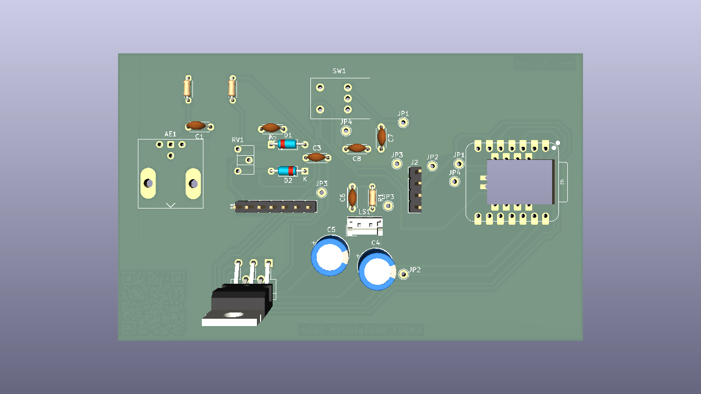
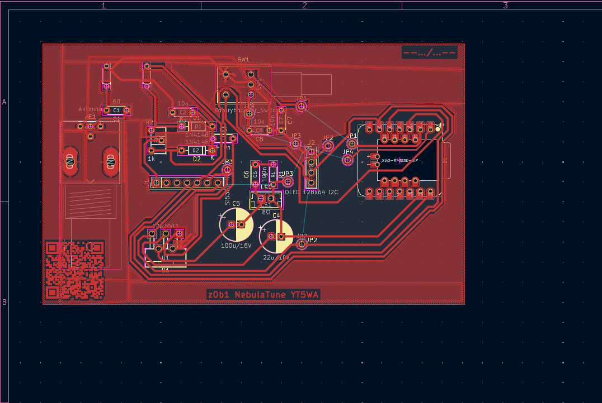
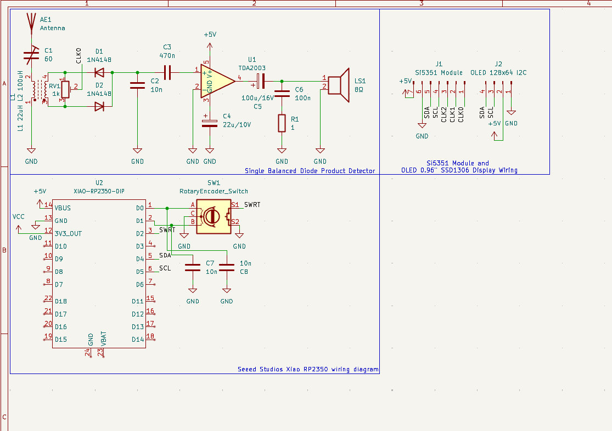
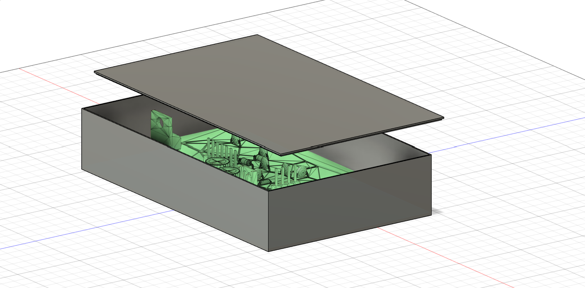

# NebulaTune

NebulaTune is a HF reciever utilizng a Direct Conversion Single Balanced Diode Product Detector along with an RP2350 to display and choose frequency and recieve with an digital encoder!

## Preview

---
# Lapse link
[View Timelapses](https://lapse.hackclub.com/timelapse/dcauUObcYn6o/)
---
# Demo

##  - link to the PCB on KiCanvas
##  - link to the SCH on KiCanvas

# Features

- Adjustable VFO with a rotary encoder;
- Frequency display;
- Direct Conversion Single Balanced Diode Product Detector;
- Speaker or headphones output;
- Wide range of frequencies(3-30MHz);
- Local oscillator high stability crystal Si5351 by SiliconLabs;
- SDR and waterfall display soon&trade;.

# DIY How to

1. Analyze the schematic and PCB design and determine if these fit your needs;

2. Gather all of the needed parts from the BOM;

3. A housing is wished for but not needed especially if you plan on tweaking my design;

4. Print the PCB(Only the `F.Cu` and that is in reverse) or order it from JLCPCB(not sponsored);

5. Install the MicroPico extension if using VS Code or just use Thonny;

6. More to come later...

# How it works
 
## General overview

This direct conversion single balanced diode product detector setup is pretty common, it utilizes the Si5351 as the local VFO. That way we eliminate the need for a frequency counter, because the frequency can be set and read with the RP2350!

## Tech details
Now lets get to the core, this direct conversion single balanced diode product detector is similar to Polyakov's mixer which is a small and easy to setup/begginer friendly HF reciever. I took inspo for the 7MHz band design, but with some tweaking the reciever should work on the whole HF band. I choose to make a reciever becuase you don't need a license to listen, and hope to bring more people into Ham Radio. The reason I used the RP2350 is because I hope to make a waterfall and split this into I and Q signals, so I can do ADC on the RP2350 and hopefully make an HF SDR Transciever.

## Explanation

Now, I hope that the reader know what HF and SDR mean, but just in case if someone doesn't know, I will explain the meaning of HF and SDR to you, also some other technical terms I used in this README.
HF just means High Frequency and that is the defined range of frequencies **in this case (3MHz to 30MHz)**. There are also other ranges like VHF, UHF, EHF, SHF and so on!
SDR means Software Defined Radio, that is if your microcontroller/PC analyze the input values of your ADC(Analog to Digital Converter) and visualise it and control the Radio via the Software.

## I'd like to add

I'd like to add although I'm in this hobby for 8 years already, and despite me being a hardware fanatic this is only my second RF project so please contribute and tell me if I have made any mistakes! Also I'm currentley looking for sponsors for my YSWS called **Propagation**!
### Propagation

Propagation is a Hack Club YSWS in production, the idea behind this is that many people have never heard of or tried the magics of RF, our goal is to get people to make projects relating RF, learn about RF and maybe get into the hobby. What separates us from other Radio related YSWS's is that we do not require a license, would be incredible if you have one but our main goal is to expand the use of RF in every sphere of life!
# Credits
Big shoutout to my father, without him, having patience and will to work is getting hard as I easily get annoyed but he gets me to enjoy this, also he's the main finder of other open source projects which I later work on and modify
---
### The idea for using the Si5351
---
[Link to github repository of the inspo for the Si5351.](https://github.com/TeknoTrek/Si5351-Clock-Generator-for-Arduino-Projects)
---
### The idea for the Direct Conversion Single Balanced Diode Product Detector
---
[Link to the Direct Conversion Single Balanced Diode Product Detector.](https://ra1ohx.ru/publ/skhemy_radioljubitelju/priemniki/prostoj_priemnik_prjamogo_preobrazovanija_na_diapazon_7_mgc/13-1-0-153)
---
> Translate the site to english, its in russian.
# Bill Of Materials
---
|Reference|Part|Qty|Price|Total|Description|
|:---|:---:|:---|:---:|:---:|:---:|